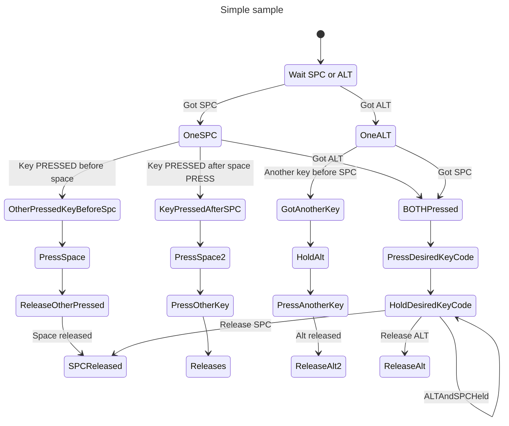

# Combine space+right alt (or space+right meta) to output a modifier

Spaceralt2level5shift allows you to

# Installation

[Interception tools](https://gitlab.com/interception/linux/tools):
```
sudo pacman -S interception-tools
```

Building and installing:
```
gcc interception_alt_space.c -o spaceralt2level5shift
mv spaceralt2level5shift ~/.local/bin/
```

# Use case

I assume that you are familiar with keyboard modifications using [xkbcomp](https://linux.die.net/man/1/xkbcomp). In that case, let's say that you mapped your apostrophe key and CAPS to ISO_Level5_Shift:

```
...
    key <AC11> {
        type[group1]= "EIGHT_LEVEL",
        symbols[Group1]= [      ISO_Level5_Shift,        ISO_Level5_Shift,          ISO_Level5_Shift,          ISO_Level5_Shift ],
        actions[Group1]= [ SetMods(modifiers=LevelFive), SetMods(modifiers=LevelFive), SetMods(modifiers=LevelFive), SetMods(modifiers=LevelFive), RedirectKey(key=<FK12>, clearMods=LevelFive)  ],
        symbols[Group2]= [      apostrophe,        quotedbl ]
    };
...
    key <CAPS> {
        type[group1]= "EIGHT_LEVEL",
        symbols[Group1]= [       ISO_Level5_Shift,       Caps_Lock,       ISO_Level5_Lock,       BackSpace ],
        actions[Group1]= [ SetMods(modifiers=LevelFive), LockMods(modifiers=Lock), LockMods(modifiers=LevelFive), NoAction(), RedirectKey(key=<HOME>, clearMods=LevelFive), NoAction(), LockMods(modifiers=LevelFive) ],
        symbols[Group2]= [       Caps_Lock ],
        actions[Group2]= [ LockMods(modifiers=Lock) ]
    };
```

However, sometimes you wish to type modified keys without having to switch your pinky. With ``spaceralt2level5shift`` on your $PATH, find the desired device name with:

```bash
evtest
```

Then, create the following script:

```bash
#!/bin/bash
keyboardName=[PUT THE DESIRED NAME FROM EVTEST]
eventNumber=$(grep -E 'Name|Handlers' /proc/bus/input/devices | grep -A 2 "$keyboardName" | grep event | awk '{print $5}') 
# 40 is KEY_APOSTROPHE see all keys in /usr/include/linux/input-event-codes.h
intercept -g /dev/input/${eventNumber} | spaceralt2level5shift KEY_RIGHTALT 40 | uinput -d /dev/input/${eventNumber}

# or KEY_RIGHTMETA
#intercept -g /dev/input/${eventNumber} | spaceralt2level5shift KEY_RIGHTMETA 40 | uinput -d /dev/input/${eventNumber}
```

# Logic

The logic can be represented by the follwing state machine:


