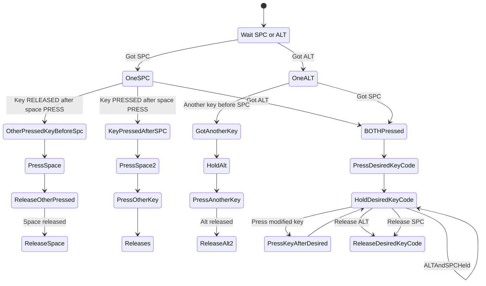

# Combine space+right alt (or space+right meta) to output a modifier

Spaceralt2level5shift allows you to output a modifier like ISO_Level5_Shift when pressing space+right alt (or space+right meta). Or, you could output Shift instead of ISO_Level5_Shift.

# Installation

[Interception tools](https://gitlab.com/interception/linux/tools):
```
sudo pacman -S interception-tools
```

Building and installing:
```
gcc interception_alt_space.c -o spaceralt2level5shift
mv spaceralt2level5shift ~/.local/bin/
```

# Use case

I assume that you are familiar with keyboard modifications using [xkbcomp](https://linux.die.net/man/1/xkbcomp). In that case, let's say that you mapped your apostrophe key and CAPS to ISO_Level5_Shift:

```
...
    key <AC11> {
        type[group1]= "EIGHT_LEVEL",
        symbols[Group1]= [      ISO_Level5_Shift,        ISO_Level5_Shift,          ISO_Level5_Shift,          ISO_Level5_Shift ],
        actions[Group1]= [ SetMods(modifiers=LevelFive), SetMods(modifiers=LevelFive), SetMods(modifiers=LevelFive), SetMods(modifiers=LevelFive), RedirectKey(key=<FK12>, clearMods=LevelFive)  ],
        symbols[Group2]= [      apostrophe,        quotedbl ]
    };
...
    key <CAPS> {
        type[group1]= "EIGHT_LEVEL",
        symbols[Group1]= [       ISO_Level5_Shift,       Caps_Lock,       ISO_Level5_Lock,       BackSpace ],
        actions[Group1]= [ SetMods(modifiers=LevelFive), LockMods(modifiers=Lock), LockMods(modifiers=LevelFive), NoAction(), RedirectKey(key=<HOME>, clearMods=LevelFive), NoAction(), LockMods(modifiers=LevelFive) ],
        symbols[Group2]= [       Caps_Lock ],
        actions[Group2]= [ LockMods(modifiers=Lock) ]
    };
```

However, sometimes you wish to type modified keys without having to switch your pinky. With ``spaceralt2level5shift`` on your $PATH, find the desired device name with:

```bash
evtest
```

Output:
```out
/dev/input/event0:      Lid Switch
/dev/input/event1:      Sleep Button
/dev/input/event10:     HDA NVidia HDMI/DP,pcm=7
/dev/input/event11:     HDA NVidia HDMI/DP,pcm=8
/dev/input/event12:     HDA NVidia HDMI/DP,pcm=9
/dev/input/event13:     HDA Intel PCH Mic
/dev/input/event14:     HDA Intel PCH Headphone
/dev/input/event15:     Logitech USB Receiver
/dev/input/event16:     Logitech USB Receiver Keyboard
```

Then, create the following script:

```bash
#!/bin/bash
keyboardName="Logitech USB Receiver Keyboard" # PUT YOUR DEVICE NAME HERE
eventNumber=$(grep -E 'Name|Handlers' /proc/bus/input/devices | grep -A 2 "$keyboardName" | grep event | awk '{print $5}') 
# 40 is KEY_APOSTROPHE see all keys in /usr/include/linux/input-event-codes.h
# 42 is KEY_LEFTSHIFT
intercept -g /dev/input/${eventNumber} | spaceralt2level5shift KEY_RIGHTALT 40 | uinput -d /dev/input/${eventNumber}

# or KEY_RIGHTMETA
#intercept -g /dev/input/${eventNumber} | spaceralt2level5shift KEY_RIGHTMETA 40 | uinput -d /dev/input/${eventNumber}
```

To run, you have the easy and the secure options:

1. Easy: add your user to the **input** group:

```bash
sudo usermod -a -G input $USER
newgrp input
./script.sh # run the script above
```

This is not secure, because any application will have access to whatever you type
through /dev/input/*.

2. Run as a system service: https://www.shubhamdipt.com/blog/how-to-create-a-systemd-service-in-linux/
```bash
# For security, prevent changes to the files
sudo chown root:root {script.sh,~/.local/bin/spaceralt2level5shift} # prevent other processes from editing this
sudo chmod 755 {script.sh,~/.local/bin/spaceralt2level5shift} # prevent other processes from editing this
sudo chattr +i {script.sh,~/.local/bin/spaceralt2level5shift} # prevent file from being deleted
```

3. Run with passwordless sudo in **input** group:

```bash
sudo chown root:root {script.sh,~/.local/bin/spaceralt2level5shift} # prevent other processes from editing this
sudo chmod 755 {script.sh,~/.local/bin/spaceralt2level5shift} # prevent other processes from editing this
sudo chattr +i {script.sh,~/.local/bin/spaceralt2level5shift} # prevent file from being deleted

#adjust your /etc/sudoers
sudo visudo
# and CHANGE your user's line to something like
YOUR_USER ALL=(ALL:ALL) PASSWD: ALL, NOPASSWD: PATH_TO_YOUR_SCRIPT

sudo -u $USER -g input ./script.sh
```

# Logic

The logic can be represented by the follwing state machine:


